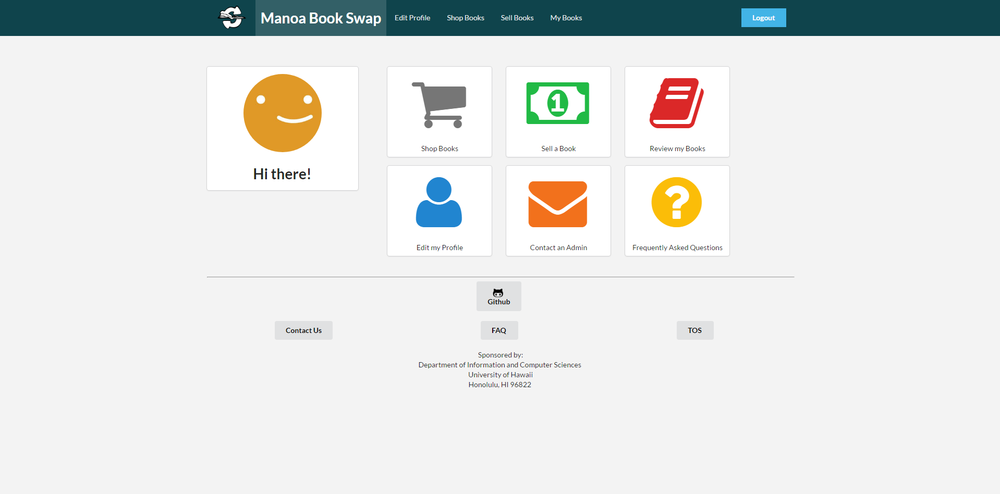

One common theme amongst college students is that we are always low on money. Spend a dollar here, spend a dollar there and next thing you know it, no more dollars to spend. So we are always looking for a way to save a buck, and that was the root of this project. We can pay anywhere up to $200 for a book that we only use one semester, and at the end of the semester the bookstore will only buy it back for $5. This is almost as bad as GameStop, but that is a story for another day. This application is a platform for college students to buy used textbooks from other peers. It is a win-win-lose, the seller is making more money than what they would of gotten from the book store plus the feeling of knowing that someone didn't have to pay the retail price. The buyer is getting the textbook for a fraction of the price. And the bookstore loses, but that doesn't bother us college students.

My contributions to this project was mostly the front-end stuff. I made the mockups for most the pages, and helped tidy/clean up the other pages. It allowed me to put to use all that HTML/CSS stuff I learned from ICS 314. It was so much fun, that I might consider a career in front-end development. I also dabbled in a little bit of back-end stuff, such as interacting with MongoDB.

This was my first software group project, so I learned so many things. I learned how important it is to have good configuration management. I also learned how powerful Git and GitHub is, God bless Gitub. Lastly, it vastly improved my HTML/CSS toolset.

You can check out the project here at: https://github.com/manoabookswap/manoabookswap
