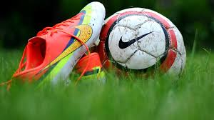

## What is MISO?

MISO stands for Major Island Soccer Organization. It is a competitive soccer league here on Oahu. Sadly, it is strictly for males. If you interested in joining http://www.islandsoccer.com/

## How did it happen?

We got a bunch of our high school friends together and made a team. But you can't just show up on Sunday and expect to play, you had to do a lot of behind the scenes stuff. Out of my group of friends, I was the Team Manager/Coach because I was trusted to do all the paperwork, go to meetings, keep track of dates, etc. I learned a lot from having to be a manager. It isn't a joke to be a manager, especially with no previous experience. 

## 2012-2013 Season

Man, it was brutal. It did not go at all on how we wanted it to go. We lost all of our games, and ended the season last place. Some games were close, but majority of them were blow outs. It was embarassing and was really quite a shame we couldn't do better. We had the talent on our roster, but the main problem was off the field issues. Literally there were times when we would go into the games with just seven people, the bare minimum before you have to forfiet. We were all still kids, and we were playing with people that are like anywhere between 20 to 40 years old. I guess we didn't really want to play, but it was just the idea of playing is what we wanted. At the end of the season we decided it wasn't worth to do another season, and we just disbanded.

## What went wrong?

Well this is a really long list, but I will keep it to just a couple of points. One, was definitely the money it cost to play in this league. It was unreal how expensive it is. I don't remember how much exactly, but I think it was over $2000 a season. Second, we were too young and naive. Most the the time if we were short people for our games it was because our players would have to study for a class/test, or couldn't trade away their work shift. Third, we didn't take it seriously. People would miss the games because they went out the night before, and so couldn't wake up in time. Fourth, the games were at Waipio. This one we knew in advance, but it didn't actually click until later into the season. Driving there was a hassle, and then knowing that you are driving that far just to get our butts handed was depressing. Not only that, but it is dirty hot at Waipio during the games. They don't have lights for the fields out there, so we would have to play during the day. Fifth, was stamina. Since we almost never had a full team, we would have to play the full game. While the other team would be rotating players and keeping their legs fresh.

## What did I learn?

Because of this event in my life, I look beyond whats in front of me. I play situations in my head and try to analyze what I am getting into before making decisions that will last longer than ten minutes. Being in charge of 20+ people is not an easy task. Keeping track of everyone and everything was absolute chaos. As the season went on I got use to it, but at first it was a true struggle. Managing players is very difficult. It isn't like FIFA where you can just plug any player wherever. Players have personalities and styles that have to be complimented. You can't just throw two people in a room and expect them to become friends. Lastly, games aren't won on paper. Not being cocky, in division 3, I truly felt our team roster was the second best in the division.

## Would I do it again?

Yes I would, but only if the situation was perfect. The situation would be perfect if: My friends would have jobs with set schedules. Money has to not have to be a problem for us. They fix the field at Waikiki, so we can play there instead of Waipio.
