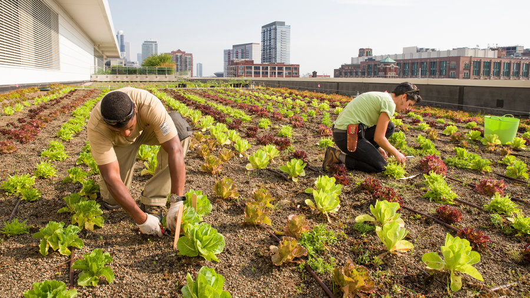

## What is WWOOF?

I could explain what WWOOFing is, but I am not going to. I am not going to explain what it is because I don't want to undersell or oversell it to you. I don't want to wake up one day to an email that says, "Hey! I did WWOOF and that is not anything like how you explained it!!!" I will say this though, WWOOF is available in a lot of different countries, so don't get confused when you are looking into it and wondering why there are so many different types. When I did WWOOF, I got involved with WWOOF UK, so here is their url incase you are curious: http://www.wwoof.org.uk/ They have a FAQ section, hopefully any questions you have are answered there.

## When did I go?

I went to England to WWOOF back in 2014. To be more precise, from January to April. I could have stayed longer but I didn't want to extend my visa, and also I felt it was time to come back home.

## Where did I go?

Obviously England is a huge country that has more than just one farm, so I couldn't go to all of them. I went to three farms in total, but they were all very far from each other. My first farm I went to was in a small area near Leicester, I think it is was Belvoir (not 100% sure if it was called this). I do remember that there was a castle (or was it a super giant mansion?) not too far away. Anyways, this was more towards the middle region of England.

The second farm I went to was in New Forest, which is a little south of Southampton. Which is located in the southern region of England. What was crazy cool about this place was that they had ponies just walking around. I didn't know that there was a difference between ponies and horses, but there is a clear difference. I'm not talking about the ponies being on the farm, I'm talking about like the region itself had ponies just chilling doing their thing.

The third farm I went to was in York, which is in the north region of England. I wasn't in the actual city itself, but the outskrit of the city. I didn't know this until after going, but New York in America was named after York in England.

## Why WWOOF?

I took a semester off school and didn't know what to do. My mom found out about WWOOFing, and so I read into and figured that it would be fun to give it a try. To be quite honest, I had no interest in farming, but I saw this as an opportunity to break out of my comfort zone so I went with it. Going to a country I have never been, doing something I have never done, and all on my own. Looking back it was crazy and risky, but I am so happy I did it. My timing was very lucky because ISIS wasn't an international issue back in 2014.

## Would I do it again?

Of course! I wouldn't consider myself a farmer by any means, but WWOOFing is more than just farming. To me, WWOOFing is about meeting new people, doing things outside of the norm, embracing a different culture, and just destroying your comfort zone. Except I would wait until I have more money. My one regret was I couldn't do everything I wanted because I didn't have the money.

## Should you WWOOF?

I don't think WWOOFing is for everyone. It isn't a vacation type of thing, you definitely do hard work. Not all the work is hard, and they know that you are just a volunteer but still. If you do choose to WWOOF, do make sure you check what the temperature will be when you go. I am from Hawaii so I lived in nice warm weather my whole life. England's winter was not friendly to me. When you WWOOF, just go with an open mind and an open heart! 
